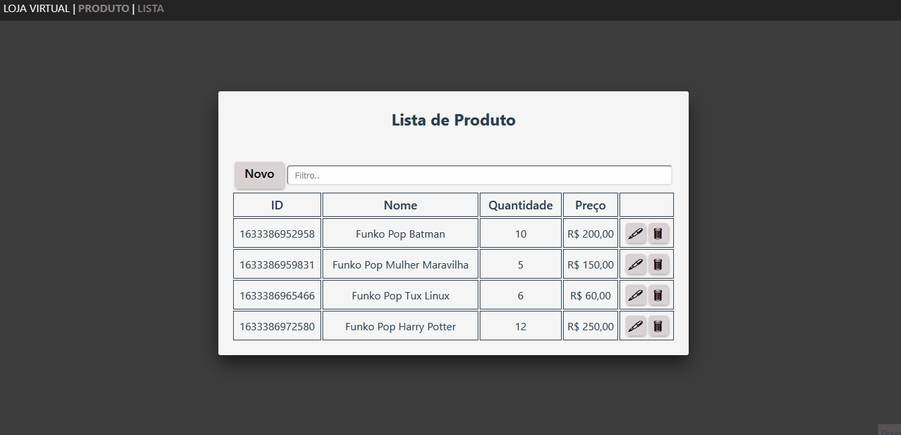

# Loja Virtual
Um simples projeto feito com VueJs, onde temos o front-end de um CRUD de produtos, com funções de Listar, Cadastrar, Editar e Excluir.


# Tecnologias utilizadas
- [Vue 2](https://vuejs.org/): Framework
- [VueX](https://vuex.vuejs.org/): _Gerenciamento dos estados com modulos_
- [Vue Router](https://router.vuejs.org/): _Gerenciamento de rotas_
- [Vuelidate](https://vuelidate.js.org/): _Validação de campos_
- [V-Money](https://www.npmjs.com/package/v-money): _Máscara de moeda_
- [Vue JS Modal](https://www.npmjs.com/package/vue-js-modal): _Modal_
- [Vue Filter](https://br.vuejs.org/v2/guide/filters.html): _Filtros para view_
- [Axios](https://www.npmjs.com/package/axios): _Requiquições Http_
- [Figma](https://www.figma.com/file/Bc67ls44qqX8WTiLfsqk6f/loja_virtual?node-id=0%3A1): _Prototipação do template do projeto_
- [CSS](https://developer.mozilla.org/pt-BR/docs/Web/CSS): _Estilização do projeto_

# Instruções para utilizar
1. Passo faça um clone no repositório do projeto
```
git clone https://github.com/adelsonguimaraes/loja_virtual.git
```
2. Passo, acesse a pasta do projeto e baixe as dependências utilizando o comando
```
npm install
```
3. Passo, finalizando o passo 2, agora inicie o servidor utilizando o comando
```
npm run serve
```
# Preview


# Demo
[Acesse a Demo Loja Virtual no Git Pages](https://adelsonguimaraes.github.io/loja_virtual/)

# Estrutura
<details>

  <summary>Clique para expandir a seção</summary>
  
  ## Source
    src            
    ├───assets     
    ├───components 
    ├───controllers
    │   └───produto
    ├───css        
    │   └───produto
    ├───filters    
    ├───router     
    ├───store      
    │   └───modules
    └───views      
        └───produto

## Controllers

A estrutura do projeto ficou dessa forma, onde eu criei uma pasta controllers para centralizar os arquivos que controlam as telas e dentro de controllers uma subpasta de cada entidade encontrada no sistema, dentro dessa pasta contendo o controller de cada tela.    

    ├───controllers
    │   └───produto
            ├───cadastroCtrl.js
            └───listaCtrl.js

## CSS

Assim como nas controllers, também criei uma pasta css para organizar os estilos e dentro dessa uma pasta de cada entidade, contendo arquvos referente as telas.

    ├───css
    │   └───produto
            ├───cadastro.css
            └───lista.css

## Views

Nas views também agrupei os arquivos referente a entidades em uma pasta dessa forma deixando o projeto mais organizado, isolado e de fácil manutenção.

    ├───views
    │   └───produto
            ├───Cadastro.vue
            └───Lista.vue

## States (VueX)

Para controlar os estados da aplicação eu utilizei o VueX, e trabalhei com modularização, assim pude separar cada entidade em um modulo.
Dentro de store temos o sub diretório modules e dentro dele o modulo de cada entidade, esse modulo depois é importado no index de store, uma vez importado no index, faço a importação os helpers em cada controller para utlização.

    ├───store      
    │   ├───modules
    │   │   └───produtos.js
        └───index.js

</details>

# Autor
- Adelson Guimarães Monteiro
- Analista Jr de Sistemas / FullStack
- [Linkedin](https://www.linkedin.com/in/adelson-guimaraes-31b31a26/): Minha rede
- [Github](https://github.com/adelsonguimaraes): Meus projetos